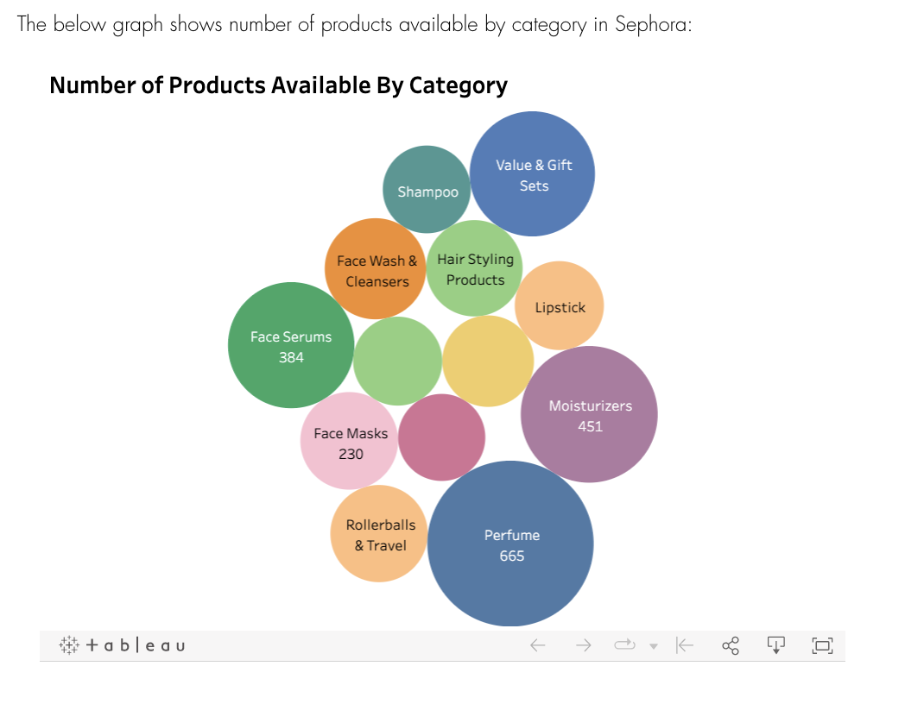
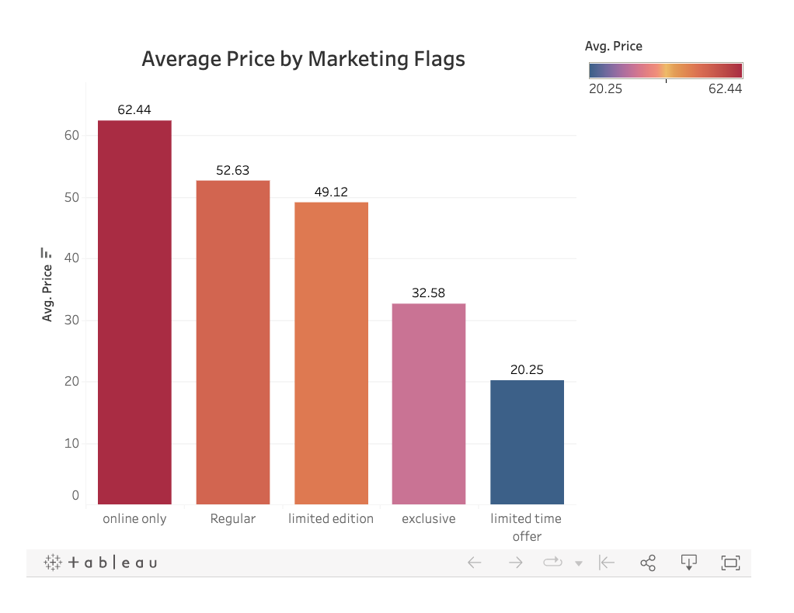
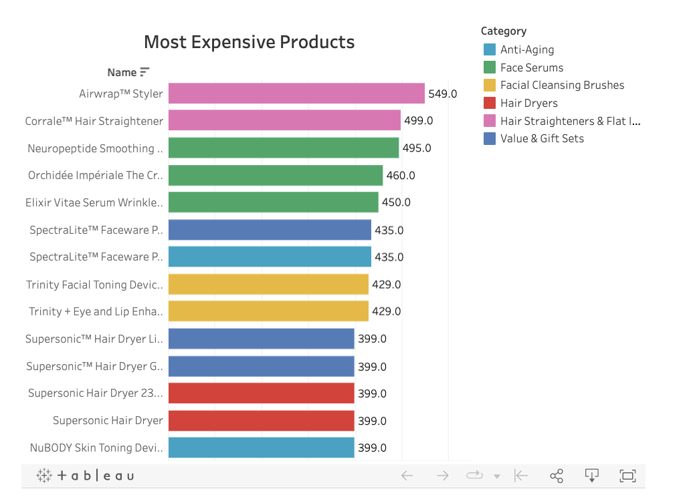

## Data Visualization - The Story Behind Sephora

**Project description:**

My project's ultimate purpose is to investigate the impact of marketing strategy and make recommendations based on pricing, ratings, and love.

Sephora.com provides a detailed classification and feedback section for each product it sells. My dataset, which includes the product's name, category, brand, rating, love, price, and marketing flags, was obtained from Kaggle. I utilize data visualization to demonstrate the features of Sephora products.

**Project website link:**

[The story behind Sephora](https://iamzhidi.wixsite.com/website)

### 1. Simple Introduction of Sephora Dataset

This Sephora dataset has included many characteristics of these products. I would like to use this Sephora dataset to draw some business insight from this dataset. I will explore the relationship between price, rating, love, and product tag.

Here I would like to show some basic information about this dataset:

### 2. Are women always crazy about limited-edition cosmetics?

There has always been a theory in the sales world that if sales tell customers that a product is a limited-edition, exclusive, or for a limited-time offer, customers will make decisions more quickly. They will be more likely to buy the product because customers worry about missing out on a great product and not getting it when they want to buy it later.

Recently, more and more cosmetic brands have chosen to sell limited products or launc h limited-time products to stimulate consumers to buy. From Sephora's data, I wanted to find out whether a limited edition, exclusive or limited-time sale would affect the price and likeability of a product.

I initially thought that the price of limit-edition or elusive products might be higher than standard products because of their scarcity. However, according to Sephora's data, the average price of standard products is higher than that of limit-edition or elusive.

### 3. Most Expensive Products in Sephora

The below graph shows top 10 most expensive products in Sephora and their category. In the most expensive products list, I am surprised that hair-related products show multiple times in the Top rank.

We also notice that the highest price for Sephora products is not unbelievable. The price of most products in Sephora should be below 400.

